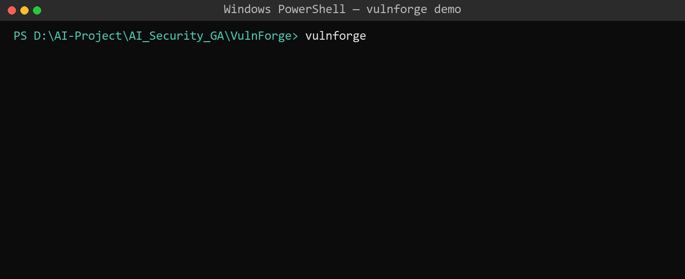
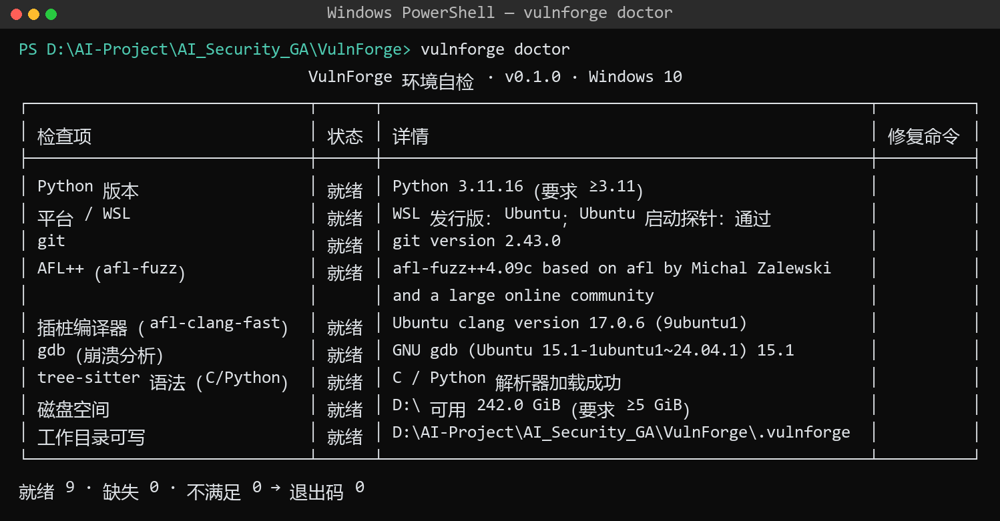
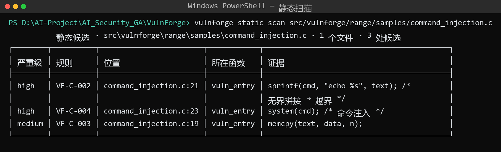
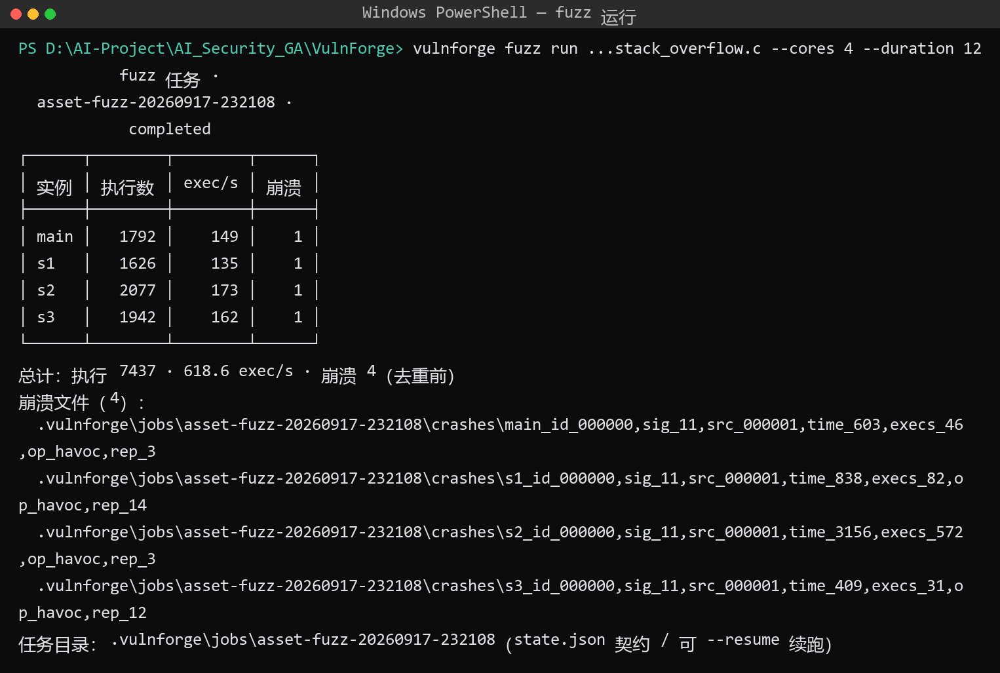
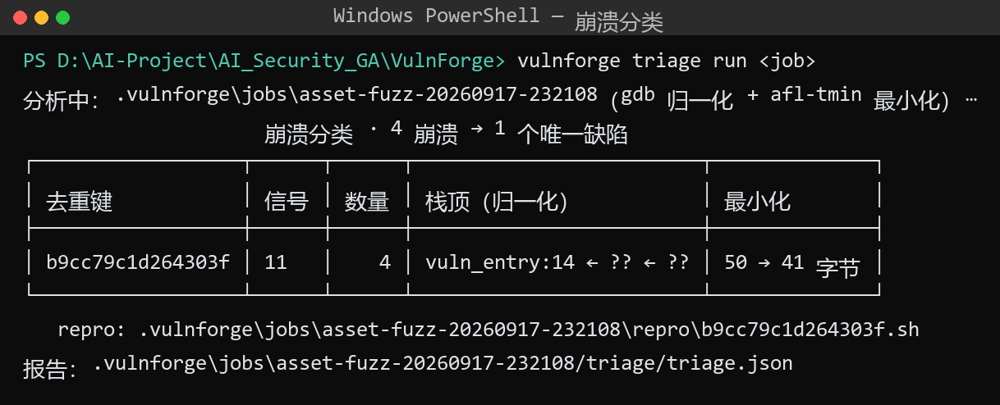
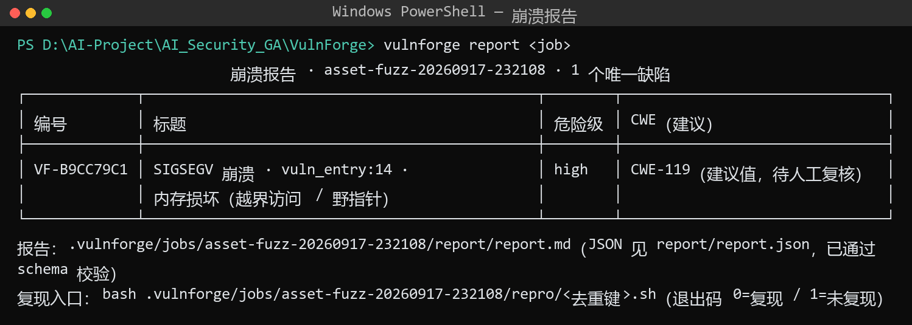

# VulnForge · 智能漏洞挖掘工作台

> 静态找点 → 模糊测试 → 崩溃分析 → 报告闭环：从源码到可提交漏洞报告的完整链路。

[](https://github.com/maoshenghe2-debug/VulnForge/actions/workflows/ci.yml)


## 演示（离线可复现）



`vulnforge demo` 单链路实测 **22.5s**（2 核 × 12s fuzz）：静态命中 → 3,736 次执行 → 2 崩溃 → **1 个唯一缺陷** → CNVD 风格报告。

| 能力 | 截图 |
|---|---|
| 环境自检（9 项 · WSL2 探测 + 一键修复命令） |  |
| 静态扫描（tree-sitter + YAML 规则 · 13 条内置） |  |
| fuzz 编排（AFL++ 多核 · 状态契约） |  |
| 崩溃分类（gdb 归一化 / 去重 / 最小化 / repro） |  |
| CNVD 风格报告（schema 校验） |  |

## 定位

VulnForge 面向**授权安全测试**场景（开源软件审计、自有系统测试、CNVD / CVE 漏洞报送），提供四段式闭环：

1. **静态分析** `vulnforge static scan` —— tree-sitter（C / Python）+ YAML 可扩展规则（13 条内置），输出「位置 + 所在函数 + 证据 + 建议」，指导 fuzz 目标选择
2. **模糊测试编排** `vulnforge fuzz run` —— AFL++（WSL2 / Linux）+ 通用 harness 模板 + 种子语料 + 多核（`-M` / `-S`）；`state.json`（≤5s 原子写）断点续跑契约、`STOP` 优雅停止
3. **崩溃分析** `vulnforge triage run` —— gdb 批处理归一化栈帧（地址剥离）→ `dedup_key = sha256(signal | top5 帧 | addr>>12)` 去重 + R1/R2 聚类合并 → `afl-tmin` 最小化 → `repro.sh`（退出码 0=复现 / 1=未复现）
4. **报告闭环** `vulnforge report` —— CNVD 风格报告（JSON schema 校验 + Markdown 渲染），证据链含输入 / 崩溃文件 SHA-256

## 快速上手

```bash
uv venv --python 3.11
uv pip install -e ".[all]"

vulnforge doctor                       # 环境自检（Windows 下经 WSL2 探测，缺失项给修复命令）
vulnforge static scan src/             # 静态扫描（--lang c,python；--json 输出）
vulnforge fuzz run target.c --cores 4 --duration 2m --seeds corpus/
vulnforge triage run .vulnforge/jobs/<job>
vulnforge report   .vulnforge/jobs/<job>
vulnforge demo                         # 单链路演示（≤10 分钟，可离线复现）
```

## 环境约定

| 项 | 约定 |
|---|---|
| 静态分析 / 报告 / CLI | 任意平台（Windows 原生可跑） |
| 模糊测试（AFL++） | **WSL2 Ubuntu 或 Linux**（`apt install afl++ clang llvm gdb`） |
| 状态契约 | `state.json` / `build.json` / `repro.sh`（断点续跑与复现验证） |

## 质量基线

- 单元 + 端到端测试 30+ 项；CI（ubuntu × Python 3.11/3.12）全绿
- **golden 标注集 pairwise 去重 F1 = 1.000**（6 靶场 / 11 个真实崩溃，契约 ≥0.95）
- 6 个自研靶场样本 30s × 2 核实测**全部必崩**（栈溢出 / 堆越界 / 双重释放 / 整数溢出 / 格式化字符串 / 命令注入）

## 设计说明（不重复造轮子）

Fuzzing 复用 **AFL++** 全家桶（子进程调用，`afl-fuzz` / `afl-tmin` 官方工具）；静态解析复用 **tree-sitter**；崩溃去重 / 最小化编排 / 报告生成为自研层（以 **casr** 为对照）。许可合规：不链接、不捆绑 GPL 组件（详见 `THIRD_PARTY_NOTICES.md`）。

## 合规声明

- 仅用于**授权**测试：自有系统、开源软件安全审计、教学靶场；
- 报告结论为**候选缺陷**：CWE 归类与严重级须人工复核后按 CNVD / CVE 负责任披露流程提交；
- 仓库内全部靶场样本为**自写教学代码**，不含真实软件漏洞利用；
- 仓库不含任何真实凭证、内网信息与敏感数据。

## 许可

Apache-2.0（见 `LICENSE`；第三方依赖见 `THIRD_PARTY_NOTICES.md`）。
